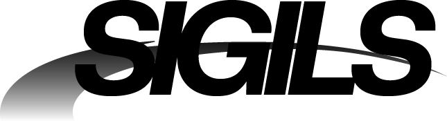

<p align="center">
  <picture>
    <source media="(prefers-color-scheme: dark)" srcset=".github/assets/sigils-logo-white.png">
    <source media="(prefers-color-scheme: light)" srcset=".github/assets/sigils-logo-black.png">
    
  </picture>
</p>

# three-sigils

Metallic shape generation for [three.js](https://threejs.org/). Open Sigils Creator below to draw.

Additionally it has photon tracing and path tracing for fun.

# Launch Sigils Creator (WebGPU)

**[Sigils Creator](https://cl0nazepamm.github.io/sigils/)**

## Install

```bash
npm install three-sigils three
```

`three` is a peer dependency (`>=0.176`). Demo uses r185

## Quick start

Draw a curve, get a chrome mesh:

```js
import * as THREE from 'three/webgpu';
import { createSigil } from 'three-sigils';

const renderer = new THREE.WebGPURenderer({ antialias: true });
await renderer.init();

const scene = new THREE.Scene();
// chrome needs something to reflect — set scene.environment to a PMREM.

const stroke = [[-0.5, 0.8], [0.7, 0.6], [0.4, -0.9], [-0.6, -0.4]];

const sigil = createSigil(stroke, {
  thickness: 0.16,
  peakHeight: 0.30,
  roughness: 0.06,
});
scene.add(sigil);
```

A stroke is a polyline: `[[x,y], ...]`, `[{x,y}, ...]`, a flat `[x0,y0,…]`,
or an array of those for multiple curves.

### Rebuilding / Interactive Changes

Shape options rerun the field → melt → solidify pipeline and need
`sigil.userData.sigil.rebuild()` (or `rebuildAsync()`):

- the stroke itself
- `symmetry`, `mirror`, `phase`, `center`
- `thickness`, `resolution`, `fieldBackend`
- `smooth`, `taper`, `taperPower`, `edgeFalloff` / `edgeFalloffNorm`
- `depthMode`, `relief`, `reliefRange`, `base`
- `laplacian`, `laplacianWeight` — mesh-adjacency Laplacian smooth passes
- `heightSmooth`, `heightSmoothWeight`

Look options stay on the same `BufferGeometry`. Most are TSL uniforms you can
change without rebuild.

- `peakHeight`, `roughness`, `envMapIntensity` — via `updateChromeMaterial`
or `sigil.userData.sigil.uniforms`
- `color`, `metalness` — set on the material directly

`profile` (`'linear'` vs `'round'`) switches the height formula in the TSL
graph; swap the material with a fresh `createChromeMaterial()` — no geometry
rebuild, but not a uniform tweak either.

```js
import { updateChromeMaterial } from 'three-sigils';

// live — same geometry, updates the chrome shader
updateChromeMaterial(sigil.material, { peakHeight: 0.5, roughness: 0.02 });

// rebuild — new silhouette
sigil.userData.sigil.rebuild(stroke, { thickness: 0.2 });
```

In Sigils Creator, almost every panel slider rebuilds; only **Peak** and **Rough**
update instantly on the committed mesh. Path trace and GLB export bake
displacement into vertices; Path Trace now refreshes that bake automatically for
live `peakHeight` changes, while an exported GLB must be re-exported.

### Hybrid WebGPU field

Use the async API when you want WebGPU compute to build the raw distance/taper
field. The generated mesh is the same `BufferGeometry`; `geometry.userData`
records whether that build used `gpu` or fell back to `cpu`.

```js
import { createSigilAsync } from 'three-sigils';

const sigil = await createSigilAsync(stroke, {
  renderer,
  fieldBackend: 'hybrid',
  thickness: 0.16,
  resolution: 460,
  laplacian: 36,
  depthMode: 'boundary',
});

console.log(sigil.geometry.userData.fieldBackend); // 'gpu' or 'cpu'
```


## API surface

**Start here** — most apps only need these:

```js
import {
  createSigil,
  createSigilAsync,
  createChromeMaterial,
  updateChromeMaterial,
  bspline,
  radialSymmetry,
} from 'three-sigils';
```

**Compose your own** — geometry builders and surface paint:

```js
import {
  buildSigilGeometry,              // strokes → BufferGeometry (aDepth/aGrad/aNormal/aDome)
  buildSigilGeometryAsync,         // optional WebGPU distance-field backend
  buildSparseCurveGeometry,        // sync sparse strips (preview path)
  buildSparseCurveGeometryAsync,   // GPU SDF merge by default
  buildGpuFieldMeshAsync,
  finishSigilGeometryFromField,
  finishSigilGeometryFromFieldAsync, // field→mesh laplacian on WebGPU
  gpuLaplacianPositions,           // adjacency Laplacian on a finished mesh (GPU)
  cpuLaplacianPositions,
  laplacianPositionsAsync,
  // Paint-on-mesh
  buildSurfaceVineGeometry,
  buildSurfaceVineFieldGeometry,
  buildSurfaceSigilGeometry,
  createMeshIndex,
} from 'three-sigils';
```

**Internal / advanced** — `prepareStrokes`, `DistanceField`, `fillRegion`,
path helpers (`toPolyline`, `resampleByLength`, …). Prefer the builders above
unless you are extending the pipeline.

Creator panel state (`createSigilState`, `shapeOptionsFromState`, …) and the
meshless raymarch path live under `examples/` — they are not part of the
published package API.

`laplacian` / `laplacianWeight` are mesh-adjacency Laplacian smooth passes
on the filled silhouette.

Smooth curves from a few control vertices come from `bspline`

```js
import { createSigil, bspline } from 'three-sigils';

const stroke = bspline([[0, 1], [0.9, 0.4], [0.5, -0.8], [-0.5, -0.8], [-0.9, 0.4]], {
  closed: true,   // periodic loop; open curves clamp to the first/last CV
});
const sigil = createSigil(stroke, { symmetry: 3, thickness: 0.18 });
```

The geometry exposes these vertex attributes:


| attribute | type  | meaning                                                                                                                                                                  |
| --------- | ----- | ------------------------------------------------------------------------------------------------------------------------------------------------------------------------ |
| `aDepth`  | float | 0 at the rim, 1 in the raised interior (`boundary`) or stroke centerline (`centerline`); `relief: 'carve'` bakes values above 1 where the fill is wider than the falloff |
| `aGrad`   | vec2  | gradient of `aDepth` (for analytic normals)                                                                                                                              |
| `aNormal` | vec3  | flat normal for the base + walls                                                                                                                                         |
| `aDome`   | float | 1 on the top surface, 0 on base/walls                                                                                                                                    |

## Run Sigils Creator

```bash
npm install
npm run example
```


| Mode              | What it does |
| ----------------- | ------------ |
| **Drawing**       | One canvas with freehand and curve tools. Freehand shows a live chrome preview while dragging. Curves are editable B-splines: place points, close at the first point or commit with double-click / Enter, drag a point to reshape, and drag its ring for variable width. Click any stroke or press Tab to select it; Delete/Backspace removes the selection. |
| **Raymarch**      | Meshless: the GPU distance field is raymarched per-pixel; nothing is read back. |
| **Paint on Mesh** | Same Freehand/Curve tools on a built-in or imported GLB. Symmetry/mirror are per-stroke. Output is a welded volume or displaced surface patch. **Conform** pulls the band into the mesh along the normal; **Manual meshing** keeps per-stroke meshes. |


Right-drag orbits, middle-drag pans; GLB export bakes the displaced chrome mesh.

### When to use which path

| Path | Use when |
| ---- | -------- |
| **Sparse preview** (`buildSparseCurveGeometry`) | Live drawing — curve-native strips, no field sampling. Cheap. |
| **Merged field** (`createSigilAsync` / `buildGpuFieldMeshAsync`) | Final chrome mesh, GLB export, welded junctions. Cost scales with `resolution` × `laplacian`. |
| **Raymarch (Creator)** | Meshless WebGPU preview in Sigils Creator only — not a library export. |

Practical budgets for merged builds: `resolution` ~280–460; `laplacian` ~0–54.
Higher values look softer and cost more; hybrid falls back to CPU when compute is unavailable.

Surface painting uses `buildSurfaceVineFieldGeometry` / `buildSurfaceSigilGeometry`
(with optional `conform` along the surface normal).

## Notes

- The WebGL/CPU distance field uses exact spatial buckets; the WebGPU backend
  evaluates segments in parallel and keeps field blur plus **laplacian** smooth
  on compute. Mesh topology remains CPU-side so both backends produce ordinary,
  exportable `BufferGeometry`.
- `peakHeight` is in world units — scale it to your stroke coordinates.
- Chrome needs something to reflect — set `scene.environment` to a PMREM.

## Acknowledgements

Main inspiration for this WebGPU experiment

[Joe Bowers](https://no3dtools.com/)

## License

MIT
